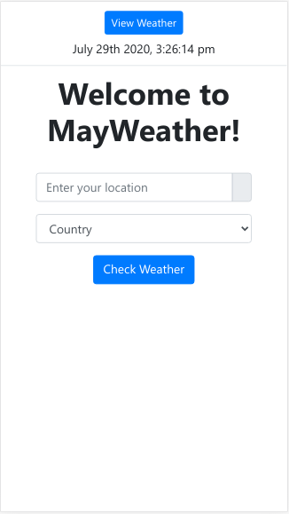

# May-Weather!

[](https://opensource.org/licenses/MIT)

  A responsive web application that displays climate information by means of **GEOLOCALIZATION** and by entering **CITY** and selecting a **COUNTRY** (by completing a form).

  - **GEOLOCATION**
  
    Displays a summary of the weather on the current day/time (city, picture, minimum temperature, maximum temperature).

  - **BY FILLING IN THE FORM**

    It will show more detailed information. 

    - _**Current**_
      Displays weather information for the current day/time (image, pressure, maximum temperature, sunrise time, wind speed, humidity, minimum temperature, sunset time)

    - _**Forecast**_
      It shows the summary information of the climate for the next 5 days (date, image, minimum temperature, maximum temperature). And each day will have detailed weather information with a 3 hour interval.

    - _**UVI**_
      Displays the current uvi index. Also the uvi index for the next 5 days. And finally it shows a line graph over the uvi index of the last 30 days.

## Demo
Here is a working live demo : https://hungry-goldberg-a40e41.netlify.app

## Site

### Home


### Current


### Forecast


### Uvi


## Mobile support

### Home Responsive



### Current Responsive


### Forecast Responsive


### Uvi Responsive


## Installation


```shell
$ git clone git@github.com:facu-zerpa/may-weather.git

$ cd may-weather/mayweather

$ npm install
```

In **MayWeather.js:43** add _**apiKEY**_ of openWeather.

```javascript
  const apiKEY = " ";
```

And finally lift the application

```shell
$ npm start
```

## Library

- [Moment.js](https://momentjs.com/)
- [Axios](https://www.npmjs.com/package/axios)
- [He](https://www.npmjs.com/package/he)
- [Plotly](https://www.npmjs.com/package/plotly.js/v/1.47.4)
- [PropTypes](https://www.npmjs.com/package/prop-types)

## License

 [](https://opensource.org/licenses/MIT)

- **[MIT license](http://opensource.org/licenses/mit-license.php)**